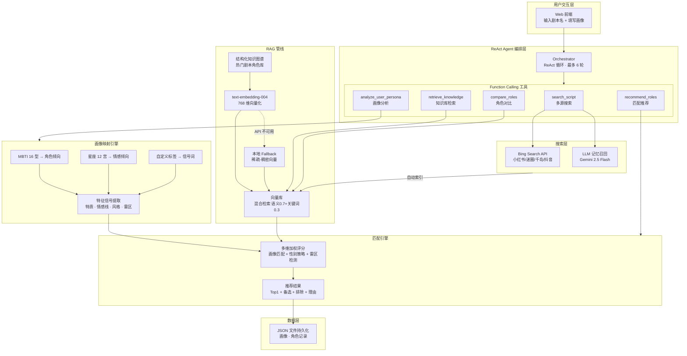

# 剧本杀 AI 选角助手

基于 **ReAct 多 Agent 协作 + RAG 检索增强** 的剧本杀角色推荐系统。输入剧本名，系统自动搜索小红书/迷圈/千岛/抖音公开评测，结合玩家 MBTI/星座/偏好画像，给出可解释的角色推荐。

## 📖 文档

- **[PRD](docs/PRD.md)** — 用户、场景、需求分析、产品流程、核心指标
- **[Agent 设计](docs/agent-design.md)** — 5 个 Agent 的职责、输入输出、触发条件、协作关系
- **[Prompt 设计](docs/prompt-design.md)** — 关键 System Prompt 的设计思路与取舍
- **[架构图](docs/architecture.md)** — 数据流、决策流、评分引擎、索引结构（Mermaid）
- **[演示指南](docs/demo.md)** — 截图/GIF 制作说明

## 架构概览



## 核心设计

| 模块 | 技术方案 | 说明 |
|------|---------|------|
| Agent 编排 | ReAct 模式 + Function Calling | 5 个工具，LLM 自主决策调用顺序，最多 6 轮 |
| RAG 检索引擎 | 混合检索（语义 0.7 + 关键词 0.3） | API/本地双模 embedding，离线可用 |
| 画像映射 | MBTI × 星座 × 标签三层映射 | 输出 4 维信号：特质、情感线、风格、雷区 |
| 多源搜索 | Bing Search API + LLM 记忆召回 | 聚合 4 个社交平台，结果自动入向量库 |
| 匹配评分 | 多维加权 + 性别策略 + 雷区检测 | 画像匹配 +7/维，性别匹配 +28，雷区 -10 到 -80 |
| 知识图谱 | 结构化剧本角色数据 | 多维度索引（角色详情 / 特征索引 / 情感线索引） |

## 关键设计约束

- **证据驱动**：仅基于公开来源推荐，找不到角色时主动追问而非编造
- **可解释性**：每个推荐附带匹配理由、证据来源、注意事项
- **安全边界**：明确的 NPC/DM/非玩家角色过滤，性别冲突分层处理
- **离线可用**：嵌入层 API 不可用时自动降级本地稀疏向量

## 快速开始

```bash
# 1. 安装依赖（零外部包，仅需 Node.js ≥ 18）
# 无需 npm install

# 2. (可选) 配置搜索能力
# PowerShell:
$env:OPENROUTER_API_KEY="你的 OpenRouter Key"    # LLM 搜索 + Agent 对话
$env:BING_SEARCH_API_KEY="你的 Bing Search Key"  # 网页搜索

# 3. 启动
npm start
# → http://localhost:4173
```

## 技术栈

- **运行时**：Node.js ≥ 18，零框架依赖
- **模型**：Gemini 2.5 Flash（推理）+ text-embedding-004（嵌入）
- **接入层**：OpenRouter API
- **搜索**：Bing Search API v7
- **存储**：JSON 文件持久化
- **安全**：接口限流 · XSS 防护 · 请求体大小限制

## 目录结构

```
├── server.js                   # HTTP 服务 + REST API
├── src/
│   ├── agent/
│   │   ├── orchestrator.js     # ReAct Agent 编排器
│   │   └── tools.js            # Function Calling 工具定义与执行
│   ├── rag/
│   │   ├── knowledgeBase.js    # 结构化剧本知识图谱
│   │   ├── vectorStore.js      # 向量库（混合检索 + 持久化）
│   │   └── embedder.js         # 嵌入层（API + 本地 fallback）
│   ├── searchAgent.js          # 多源搜索（Bing + LLM）
│   ├── roleProfiler.js         # 角色识别与信息提取
│   ├── questionAgent.js        # 动态追问生成
│   ├── matchAgent.js           # 多维匹配评分引擎
│   └── personaMapper.js        # MBTI/星座/标签 → 特征信号映射
├── docs/                       # 产品与技术文档
│   ├── PRD.md
│   ├── agent-design.md
│   ├── prompt-design.md
│   ├── architecture.md
│   └── demo.md
├── public/                     # 前端页面
├── data/                       # 运行时数据（不纳入版本控制）
└── package.json
```