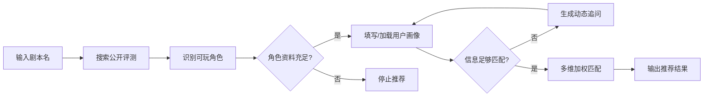

# 剧本杀 AI 选角助手 — 产品需求文档 (PRD)

> 版本: v0.2 | 状态: MVP 已完成 | 日期: 2026-07

---

## 1. 产品概述

### 1.1 一句话定义

面向剧本杀情感本玩家的 AI 角色推荐工具——输入剧本名 + 个人画像，系统自动搜索公开评测、识别可选角色、动态追问偏好、给出可解释的推荐结果。

### 1.2 解决的痛点

| # | 痛点 | 现状 | 本产品方案 |
|---|------|------|-----------|
| 1 | 官方心测覆盖率低 | 大量剧本没有官方性格测试 | 从公开评测中自动提取角色信息 |
| 2 | 标签化选角不准 | 玩家靠 MBTI/星座口头匹配，翻车率高 | 多层画像映射 + 多维加权评分 |
| 3 | 推荐缺乏解释 | 其他玩家推荐只说"适合你"，不说原因 | 每条推荐附带匹配理由和证据来源 |
| 4 | 跨本选角无记忆 | 每次玩新本重新选，历史偏好丢失 | 持久化角色记录，分析历史偏好模式 |

---

## 2. 目标用户

### 2.1 用户画像

| 属性 | 描述 |
|------|------|
| 核心人群 | 18-30 岁剧本杀玩家，偏好情感本/沉浸本 |
| 使用场景 | 组车前选角、店家拼车时推荐角色 |
| 技术水平 | 普通手机用户，非技术背景 |
| 核心诉求 | "帮我选一个不会翻车的角色，并告诉我为什么" |

### 2.2 用户场景

**场景 A：新手玩家选角**
> 小林第一次玩《告别诗》，DM 发了心测但结果她觉得不太像自己。她在群里说了 MBTI 和星座，群友开始七嘴八舌推荐。她不知道信谁，最后盲选了林星落，结果全程坐牢。

**场景 B：老玩家跨本选角**
> 阿杰玩过十几个情感本，每次都要重新"自我介绍"。他想找一个 "像我上次玩顾言那种感觉" 的角色，但新本的测评太多懒得翻，只能凭直觉选。

**场景 C：店家拼车推荐**
> 剧本杀店家老张同时开 3 车，每车都有玩家不认识，DM 没时间一个一个帮忙选。他希望有个工具能让玩家自助选角。

---

## 3. 产品流程

### 3.1 核心流程

### 3.2 推荐结果结构

每次推荐输出：

| 字段 | 说明 |
|------|------|
| 推荐角色 | Top 1 匹配角色 + 评分 |
| 匹配理由 | 画像匹配点、情感线覆盖、风格共鸣 |
| 风险提示 | 雷区冲突、反串提醒、低置信度警告 |
| 备选方案 | 2 个次优角色 |
| 排除角色 | 性别不匹配等已自动过滤的角色 |

---

## 4. 核心指标

### 4.1 MVP 阶段指标（当前）

| 指标 | 定义 | 当前状态 |
|------|------|---------|
| 搜索覆盖率 | 输入剧本名后有返回结果的比例 | 知识库覆盖 7 个热门本，联网搜索待验证 |
| 角色识别准确率 | 识别的角色与官方角色表一致的比例 | 正则 + LLM 双模式 |
| 推荐理由引用率 | 推荐结果中有具体证据引用的比例 | 100%（设计约束） |
| 追问有效率 | 追问后用户画像信息增量 | 待用户验证 |

### 4.2 下一阶段指标（待上线）

| 指标 | 定义 | 目标 |
|------|------|------|
| 选角满意度 | 用户采纳推荐后的满意度评分 | ≥ 80% |
| 推荐采纳率 | 用户选择推荐 Top1 的比例 | ≥ 60% |
| 回车率 | 同一用户二次使用的比例 | ≥ 40% |

---

## 5. 关键设计约束

1. **证据驱动**: 仅基于公开来源角色信息推荐，找不到 → 停止，信息不足 → 追问，绝不编造
2. **可解释性**: 每条推荐必须附带匹配理由、证据来源、注意事项
3. **隐私优先**: 用户画像和角色记录本地存储，不上传云端
4. **NPC 过滤**: 明确排除 NPC、DM、主持人、店家、作者等非玩家角色
5. **性别策略**: 支持性别偏好 + 反串态度分层处理，不接受反串时自动排除性别不匹配角色