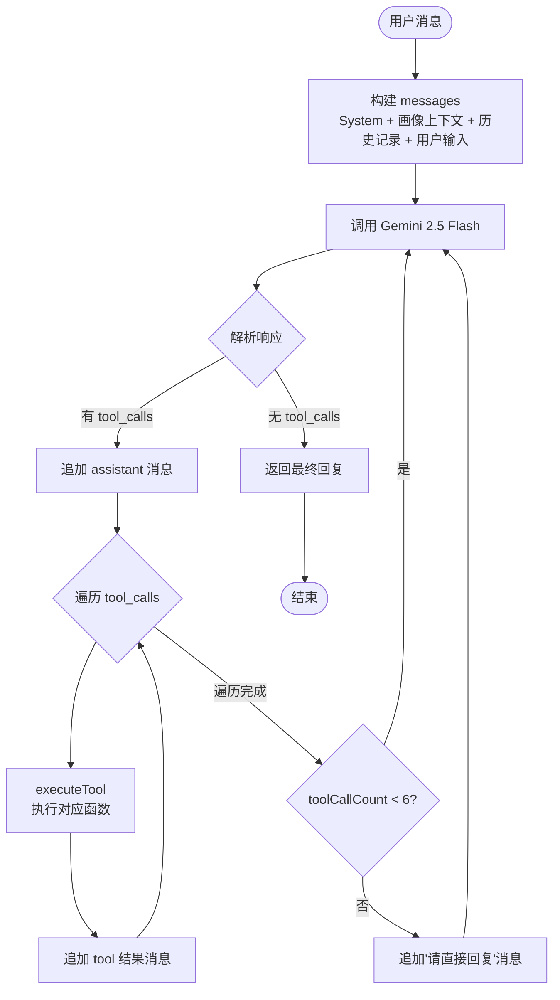
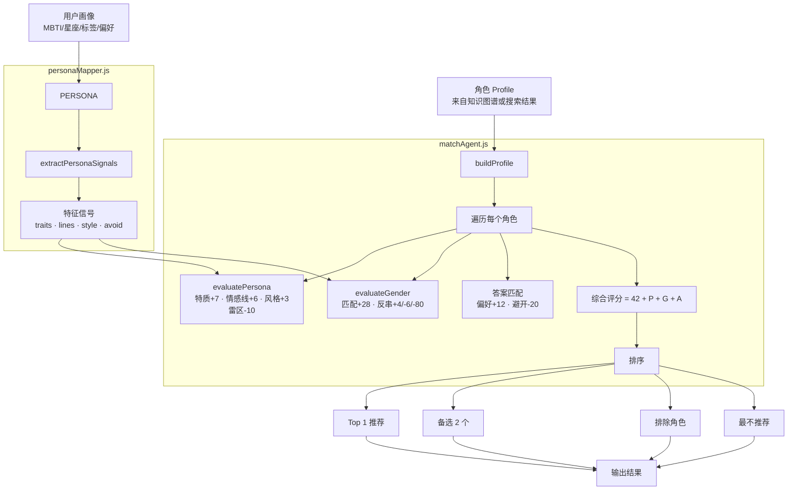

# 剧本杀 AI 选角助手 — 架构与数据流文档

---

## 1. 系统全景数据流

```mermaid
flowchart TB
    subgraph 用户入口 [用户]
        INPUT[输入剧本名 + 填写画像]
    end

    INPUT --> API[/api/agent 或 /api/research + /api/match]

    subgraph 服务层 [server.js]
        API --> ROUTE{路由判断}
        ROUTE -->|Agent 模式| AGENT_API[/api/agent]
        ROUTE -->|传统模式| RESEARCH[/api/research]
    end

    subgraph Agent编排 [Orchestrator ReAct 循环]
        AGENT_API --> CTX[注入上下文<br/>画像 + 角色记录]
        CTX --> LOOP{ReAct 循环<br/>max 6 轮}
        LOOP --> LLM[Gemini 2.5 Flash<br/>temperature=0.3]
        LLM --> TOOL{有 tool_calls?}
        TOOL -->|是| EXEC[执行工具]
        EXEC --> LOOP
        TOOL -->|否| REPLY[生成最终回复]
    end

    subgraph 工具层 [5 个 Function Tools]
        EXEC --> T1[search_script]
        EXEC --> T2[retrieve_knowledge]
        EXEC --> T3[analyze_user_persona]
        EXEC --> T4[recommend_roles]
        EXEC --> T5[compare_roles]
    end

    subgraph 搜索层 [多源搜索]
        T1 --> BING[Bing Search API v7]
        T1 --> LLM_RECALL[LLM 训练记忆召回]
        BING --> PROFILER[roleProfiler<br/>LLM提取 → 正则回退]
        LLM_RECALL --> PROFILER
    end

    subgraph RAG管线 [向量检索]
        T2 --> HYBRID[混合检索<br/>语义 0.7 + 关键词 0.3]
        HYBRID --> EMBED[text-embedding-004]
        HYBRID --> KW[BM25 关键词匹配]
        EMBED -.->|API 不可用| LOCAL[本地稀疏-稠密<br/>L2 归一化 fallback]
        HYBRID --> VS[(向量库 JSON)]
    end

    subgraph 画像层 [画像映射引擎]
        T3 --> MBTI_MAP[MBTI 16 型映射]
        T3 --> ZODIAC_MAP[星座 12 宫映射]
        T3 --> TAG_MAP[自定义标签映射]
        MBTI_MAP --> SIG[特征信号<br/>特质 · 情感线 · 风格 · 雷区]
        ZODIAC_MAP --> SIG
        TAG_MAP --> SIG
    end

    subgraph 匹配层 [匹配评分引擎]
        T4 --> KB_QUERY[查询知识图谱]
        KB_QUERY --> SCORE[多维加权评分]
        SIG --> SCORE
        SCORE --> RESULT[推荐结果]
    end

    subgraph 持久化 [数据存储]
        SIG -.-> PERSONA[(persona.json)]
        RESULT -.-> RECORDS[(records.json)]
        搜索层 -->|自动索引| VS
    end

    RESULT --> REPLY
    REPLY --> OUTPUT[返回给用户]
```

---

## 2. ReAct Agent 决策流程



---

## 3. 匹配评分引擎数据流



---

## 4. 知识图谱索引结构

```mermaid
flowchart LR
    subgraph 原始数据 [knowledgeBase.js]
        S1["告别诗: 情感本 6人 3男3女"]
        S2["古木吟: 情感本 6人 3男3女"]
        S3["来电: 欢乐机制本 6人 ..."]
        S4["... 共 7 个剧本"]
    end

    subgraph 索引生成 [buildKnowledgeDocs]
        S1 --> D1[剧本概览文档]
        S1 --> D2[林星落 角色详情]
        S1 --> D3["敏感 高共情 缺爱 类型角色索引"]
        S1 --> D4["爱情 亲情 线角色索引"]
        D1 --> EMBED
        D2 --> EMBED
        D3 --> EMBED
        D4 --> EMBED
    end

    subgraph 向量化 [embedder.js]
        EMBED[text-embedding-004<br/>或本地 fallback] --> VS[(向量库<br/>768 维)]
    end

    subgraph 检索 [vectorStore.js]
        Q[查询: "高共情玩家角色"] --> HYBRID[混合检索]
        VS --> HYBRID
        HYBRID --> R[结果: 林星落 0.89, 林小鱼 0.82, ...]
    end
```

---

## 5. 技术栈一览

| 层级 | 技术 | 说明 |
|------|------|------|
| 运行时 | Node.js ≥ 18 | 零外部 npm 依赖 |
| 推理模型 | Gemini 2.5 Flash | OpenRouter 接入，temperature 0.3 |
| 嵌入模型 | text-embedding-004 | 768 维，API + 本地 fallback |
| 搜索 | Bing Search API v7 | 多查询词 + 平台识别 |
| 向量库 | 自建 JSON | 内存余弦相似度 + 文件持久化 |
| 前端 | Vanilla HTML/CSS/JS | 零框架 |
| 存储 | JSON 文件 | 画像 + 角色记录 |